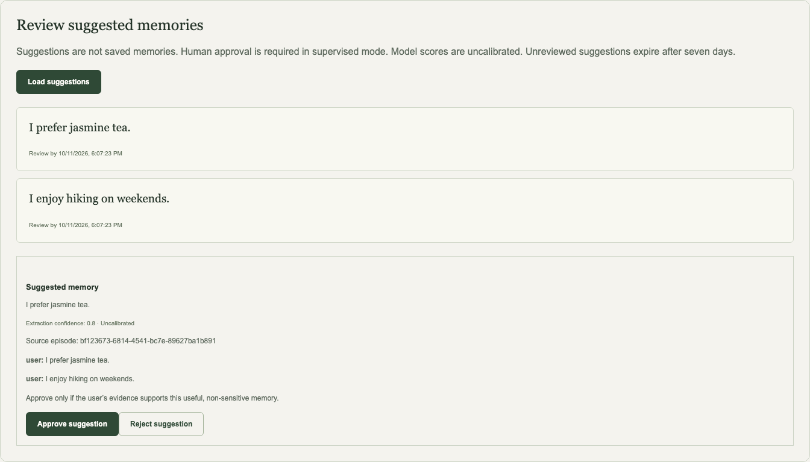
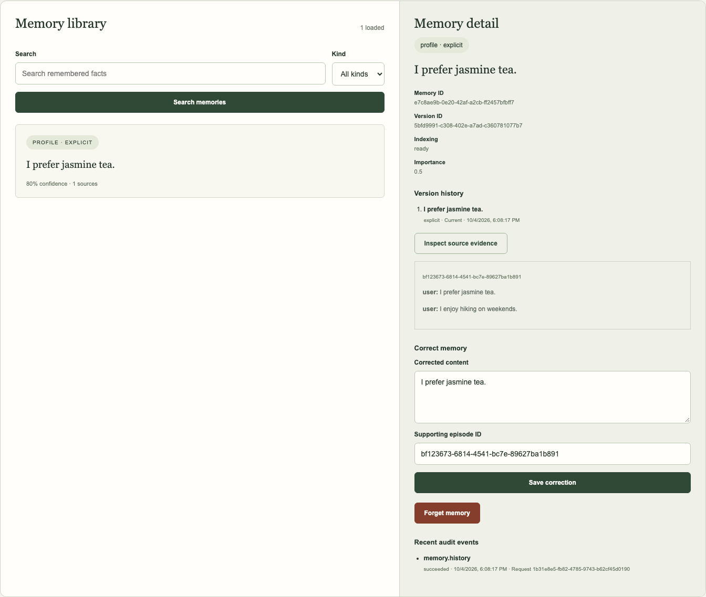

# Agent Memory

Give AI agents durable context—with evidence and human control.

Agent Memory captures conversations, suggests useful memories, and retrieves cited context for later interactions. Its operator console lets you review suggestions, inspect sources, correct facts and forget memories.

**Current status:** verified development baseline with a supervised review flow. The demo uses synthetic data and offline extraction/embeddings. Model scores are uncalibrated; automatic acceptance and production deployment remain gated.

## Try it locally

Requires Python 3.11+, Node.js 24 and Docker running. From the repository root:

```sh
python3 -m venv .venv
source .venv/bin/activate
pip install -e .
npm --prefix apps/web ci
python docs/demo.py
```

The demo creates a fresh disposable database, starts the API and console, and prints local connection instructions. It makes **no live model requests**. Ctrl+C stops its processes and removes only its own container. See [local setup](docs/local-setup.md) for token handling, persistent development setup and troubleshooting.

## In the console



Review a suggestion against its source before saving it. Suggestions stay out of retrieval until approved and expire after seven days.



Inspect saved memories, append corrections and confirm forgetting. These are genuine local app screenshots using the offline fixture—not live-provider results.

## Guides

- [Use the console, SDK and API](docs/usage.md)
- [Install and run locally](docs/local-setup.md)
- [Configure optional providers privately](docs/providers.md)
- [Architecture and trust boundaries](docs/architecture.md)
- [Testing, backups and production requirements](docs/operations.md)

Python API client: `memory_sdk.MemoryClient`. Interactive API reference: `/docs` on your local API server. [OpenAPI contract](packages/contracts/openapi.json).
